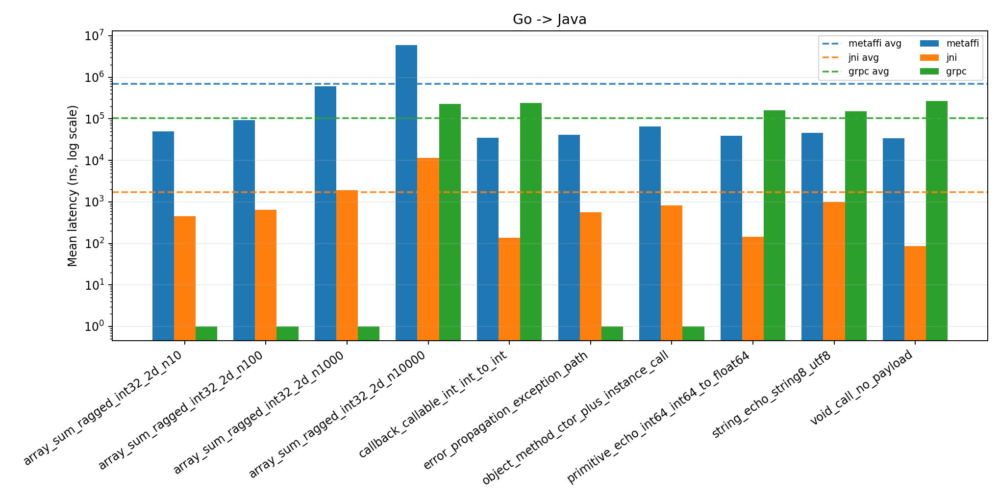
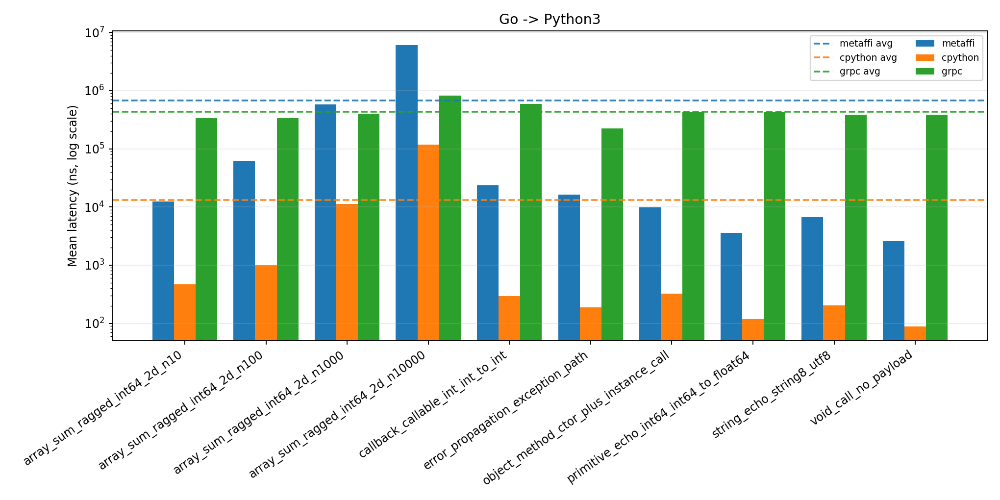
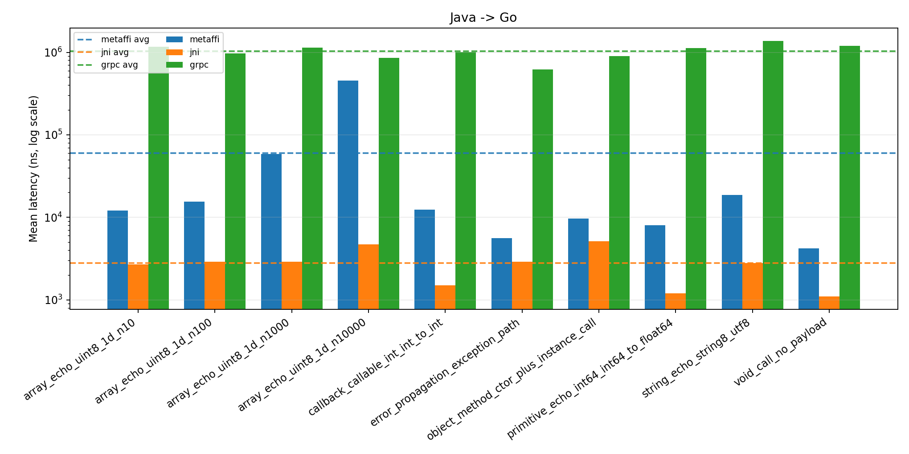
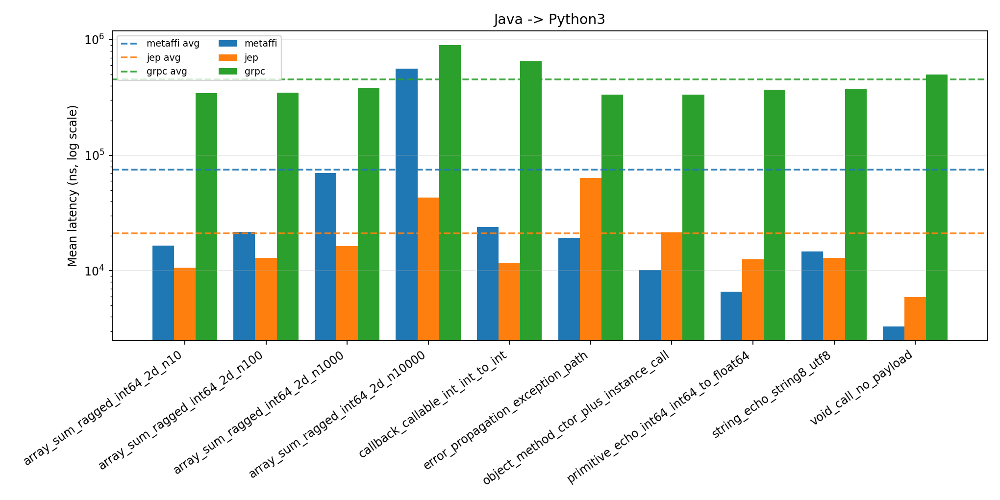
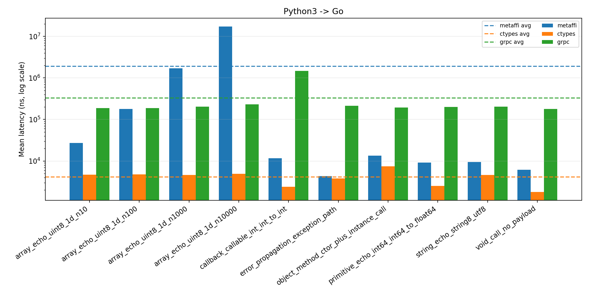
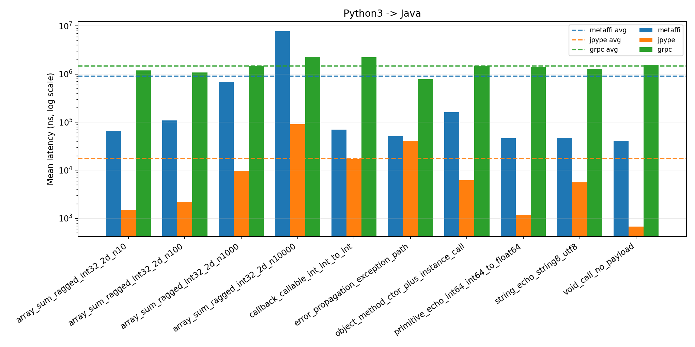
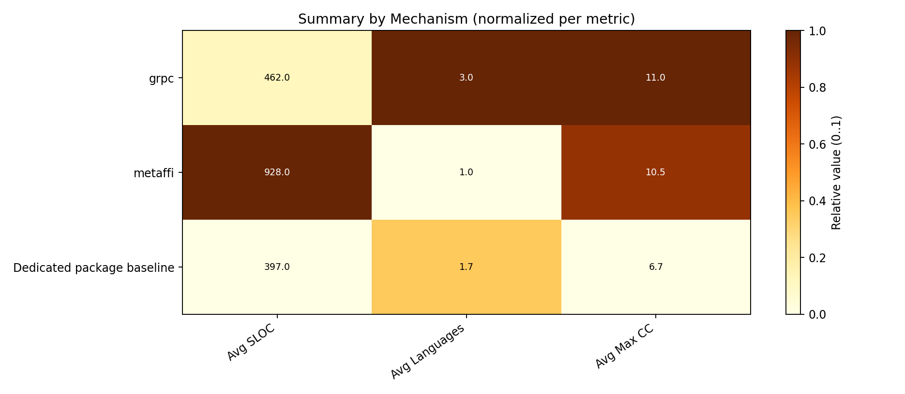
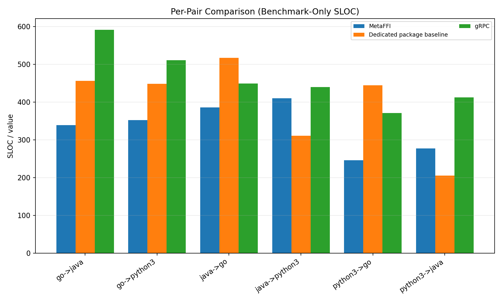
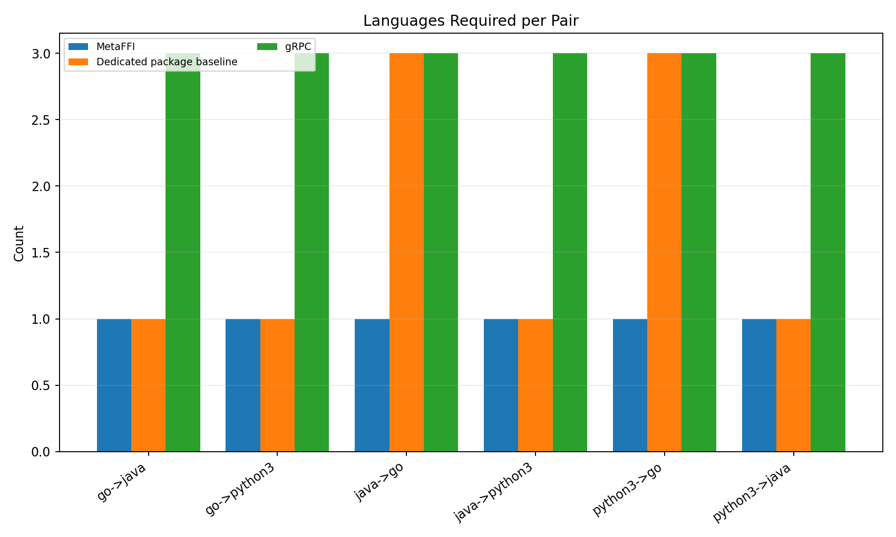

# MetaFFI Cross-Language Evaluation Report

Generated: 2026-02-13 13:48:35 UTC

## Scope

This report is generated from the benchmark/correctness consolidation and complexity analysis outputs.
It provides table-by-table visualization support for thesis writing, without injecting final conclusions.

## Inputs

- `consolidated.json`: result files=18 / expected=18
- `consolidated.json`: benchmarks passed=180, failed=0
- `complexity.json`: pair comparisons=6
- `tables.md`: tables parsed=9

## Analysis Notes

- Performance charts use the mean values reported in `tables.md` and are converted to nanoseconds for plotting.
- Pair performance charts use logarithmic Y-scale due to multi-order magnitude spread across scenarios/mechanisms.
- Complexity summary chart is a normalized heatmap because metrics have different units/scales.
- This report is fail-fast: any malformed source value aborts generation to avoid silent misreporting.
- For performance figures, dashed horizontal lines are per-pair, per-mechanism averages loaded from `consolidated.json`.

## Benchmark Protocol

For each benchmark scenario, the execution protocol is:
1. Run warm-up iterations (excluded from reported statistics).
2. Run measured iterations and collect per-iteration latency samples.
3. Compute summary statistics from measured samples (after each test's built-in filtering/processing path).
4. Persist timing metadata, including timer-overhead measurement, into the result file.

- Warm-up reduces runtime transients (for example JVM JIT/warm caches) before sampling.
- Protocol differs across result files; exact per-triple configuration:
- `go->java [grpc]`: `warmup=100`, `measured=10000`, `repeats=1`, `batch_min_elapsed_ns=0`, `batch_max_calls=0`.
- `go->java [jni]`: `warmup=1`, `measured=20`, `repeats=1`, `batch_min_elapsed_ns=10000`, `batch_max_calls=100000`.
- `go->java [metaffi]`: `warmup=20`, `measured=200`, `repeats=1`, `batch_min_elapsed_ns=10000`, `batch_max_calls=100000`.
- `go->python3 [cpython]`: `warmup=1`, `measured=10`, `repeats=1`, `batch_min_elapsed_ns=10000`, `batch_max_calls=100000`.
- `go->python3 [grpc]`: `warmup=1`, `measured=10`, `repeats=1`, `batch_min_elapsed_ns=10000`, `batch_max_calls=100000`.
- `go->python3 [metaffi]`: `warmup=20`, `measured=200`, `repeats=1`, `batch_min_elapsed_ns=10000`, `batch_max_calls=100000`.
- `java->go [grpc]`: `warmup=1`, `measured=10`, `repeats=1`, `batch_min_elapsed_ns=0`, `batch_max_calls=0`.
- `java->go [jni]`: `warmup=100`, `measured=10000`, `repeats=1`, `batch_min_elapsed_ns=0`, `batch_max_calls=0`.
- `java->go [metaffi]`: `warmup=100`, `measured=10000`, `repeats=1`, `batch_min_elapsed_ns=0`, `batch_max_calls=0`.
- `java->python3 [grpc]`: `warmup=100`, `measured=10000`, `repeats=1`, `batch_min_elapsed_ns=10000`, `batch_max_calls=100000`.
- `java->python3 [jep]`: `warmup=100`, `measured=10000`, `repeats=1`, `batch_min_elapsed_ns=0`, `batch_max_calls=0`.
- `java->python3 [metaffi]`: `warmup=20`, `measured=200`, `repeats=1`, `batch_min_elapsed_ns=0`, `batch_max_calls=0`.
- `python3->go [ctypes]`: `warmup=100`, `measured=10000`, `repeats=1`, `batch_min_elapsed_ns=0`, `batch_max_calls=0`.
- `python3->go [grpc]`: `warmup=100`, `measured=10000`, `repeats=1`, `batch_min_elapsed_ns=0`, `batch_max_calls=0`.
- `python3->go [metaffi]`: `warmup=100`, `measured=10000`, `repeats=1`, `batch_min_elapsed_ns=0`, `batch_max_calls=0`.
- `python3->java [grpc]`: `warmup=1`, `measured=10`, `repeats=1`, `batch_min_elapsed_ns=10000`, `batch_max_calls=100000`.
- `python3->java [jpype]`: `warmup=1`, `measured=10`, `repeats=1`, `batch_min_elapsed_ns=10000`, `batch_max_calls=100000`.
- `python3->java [metaffi]`: `warmup=1`, `measured=10`, `repeats=1`, `batch_min_elapsed_ns=10000`, `batch_max_calls=100000`.
- Reported global benchmark means use pooled iterations across all repeats.

## Scenario Scope Strategy

- This benchmark suite intentionally samples multiple data/interop patterns without exhausting every type x operation x pair combination.
- Rationale: a fully crossed design would multiply the experiment matrix substantially beyond the current 18 triples and 10 benchmark scenarios per triple.
- Therefore, array scenarios are representative by pair and guest API constraints (including ragged-array sum and byte-array echo), and are explicitly labeled below.

## Scenario Definitions

- `void_call_no_payload` (source key: `void_call`): minimal function invocation overhead with no data payload.
- `primitive_echo_int64_int64_to_float64` (source key: `primitive_echo`): primitive transfer and return.
- `string_echo_string8_utf8` (source key: `string_echo`): string marshaling overhead using MetaFFI `string8` (UTF-8).
- Native baseline note for `string_echo`: CPython path uses UTF-8 APIs; JNI path uses `GetStringUTFChars` / `NewStringUTF` (JNI modified UTF-8).
- Ragged-array sum scenarios in tables are rendered as `array_sum_ragged_<type>_2d_n<size>`.
- Byte-array echo scenarios in tables are rendered as `array_echo_uint8_1d_n<size>`.
- Exact array payload types in this dataset by pair:
- `go->java`: ragged `int32[][] -> int32` (rendered as `array_sum_ragged_int32_2d_n<size>`).
- `python3->java`: ragged `int32[][] -> int32` (rendered as `array_sum_ragged_int32_2d_n<size>`).
- `go->python3`: ragged `int64[][] -> int64` (rendered as `array_sum_ragged_int64_2d_n<size>`).
- `java->python3`: ragged `int64[][] -> int64` (rendered as `array_sum_ragged_int64_2d_n<size>`).
- `java->go`: `uint8[] -> uint8[]` roundtrip (rendered as `array_echo_uint8_1d_n<size>`).
- `python3->go`: `uint8[] -> uint8[]` roundtrip (rendered as `array_echo_uint8_1d_n<size>`).
- `object_method_ctor_plus_instance_call` (source key: `object_method`): object construction/handle passing and instance call.
- `callback_callable_int_int_to_int` (source key: `callback`): callable transfer and reverse invocation across boundary.
- `error_propagation_exception_path` (source key: `error_propagation`): exception/error signaling overhead.

## Array Family Interpretation

- Two array workload families are intentionally present: ragged-array sum (`array_sum_ragged_*`) and byte-array echo (`array_echo_uint8_*`).
- These families serve the same high-level goal (array marshaling stress across sizes), but they are not semantically identical operations.
- Comparative claims should be made within the same family across mechanisms for a given pair.
- Cross-family absolute ranking (for example, comparing `array_sum_ragged_*` directly against `array_echo_uint8_*`) should be avoided in conclusions.

## Threats To Validity

- Timer-floor effect: values displayed as `0 ns` indicate latency below effective timing resolution for the single-call measurement method.
- Native baseline heterogeneity: dedicated pair-specific packages (JNI/CPython/ctypes/JPype/JEP) are practical baselines, not a single uniform raw-native method.
- Pair-specific API constraints: scenario signatures differ by guest module/API compatibility (for example ragged int32/int64 sum vs uint8 echo).
- Runtime effects: JIT/runtime warm-up behavior (especially JVM-host cases) can influence steady-state timing and motivates explicit warm-up control.
- Result interpretation should therefore remain scenario-signature aware and reproducibility-bounded to this exact tooling/version set.

## Table 7 Metric Definitions

- `Count`: number of implementations in that mechanism group (6 pair-directions per mechanism family).
- `Avg SLOC`: average source-code lines (SLOC) across implementations in the group.
- `Avg Benchmark SLOC`: average benchmark-only SLOC; MetaFFI correctness-only files are excluded.
- `Avg Languages`: average number of programming languages per implementation.
- `Avg Files`: average count of source files per implementation.
- `Avg Max CC`: average of each implementation's maximum cyclomatic complexity.
- `SLOC` vs `LOC`: SLOC counts only non-blank, non-comment lines (LOC includes comments/blanks).
- Tooling:
  - `cloc` for SLOC counting (non-blank, non-comment lines).
  - `lizard` for cyclomatic complexity (`python -m lizard --csv ...`).
  - Reference: https://github.com/terryyin/lizard

## Baseline Interpretation (MetaFFI vs Native Packages)

- Native baselines are intentionally practical per pair. The concrete baselines in this dataset are:
- `go->java`: `jni` (Java Native Interface bridge (includes language-specific native glue where needed).)
- `go->python3`: `cpython` (Go <-> Python bridge via CPython C API.)
- `java->go`: `jni` (Java Native Interface bridge (includes language-specific native glue where needed).)
- `java->python3`: `jep` (Java Embedded Python (JEP) package.)
- `python3->go`: `ctypes` (Python ctypes FFI package.)
- `python3->java`: `jpype` (Python JPype package (JVM bridge).)
- Therefore, comparisons should be interpreted as: **MetaFFI vs strongest practical direct bridge available at experiment time**.
- This is not identical to a pure "raw native glue" comparison in every pair, because libraries like JEP/JPype abstract some low-level integration code.
- The uniformity claim for MetaFFI remains orthogonal: one approach across all pairs/mechanisms vs heterogeneous package-specific approaches.
- To address "future better package" arguments, keep conclusions version/time bounded and tied to reproducible baselines used in this experiment.

## Notes

- Values shown as `0 ns` mean the measured latency is below effective timer+measurement resolution for the single-call method in this environment.
- In performance figures, `0 ns` points are rendered at `1 ns` only so they can be shown on logarithmic axes; this is a visualization floor, not a claimed runtime value.
- In Tables 7-9, "native" refers to **dedicated per-pair interoperability packages** (e.g., JEP/JPype/JNI/cgo/ctypes), not a uniform raw-native implementation style.

## Repeat-Mean Tables

- Each table reports per-repeat means (`run_i_mean`), the arithmetic `mean_of_repeat_means`, and the published `global_pooled_mean`.
- Figures in this report use only `global_pooled_mean` values.

### go -> java [jni]

| Scenario | run_1_mean | mean_of_repeat_means | global_pooled_mean |
|---|---|---|---|
| array_sum_ragged_int32_2d_n10 | 458.1 ns | 458.1 ns | 458.1 ns |
| array_sum_ragged_int32_2d_n100 | 647.0 ns | 647.0 ns | 647.0 ns |
| array_sum_ragged_int32_2d_n1000 | 1.9 µs | 1.9 µs | 1.9 µs |
| array_sum_ragged_int32_2d_n10000 | 11.5 µs | 11.5 µs | 11.5 µs |
| callback_callable_int_int_to_int | 137.9 ns | 137.9 ns | 137.9 ns |
| error_propagation_exception_path | 562.9 ns | 562.9 ns | 562.9 ns |
| object_method_ctor_plus_instance_call | 831.6 ns | 831.6 ns | 831.6 ns |
| primitive_echo_int64_int64_to_float64 | 144.7 ns | 144.7 ns | 144.7 ns |
| string_echo_string8_utf8 | 982.9 ns | 982.9 ns | 982.9 ns |
| void_call_no_payload | 87.0 ns | 87.0 ns | 87.0 ns |

### go -> python3 [cpython]

| Scenario | run_1_mean | mean_of_repeat_means | global_pooled_mean |
|---|---|---|---|
| array_sum_ragged_int64_2d_n10 | 466.1 ns | 466.1 ns | 466.1 ns |
| array_sum_ragged_int64_2d_n100 | 1.0 µs | 1.0 µs | 1.0 µs |
| array_sum_ragged_int64_2d_n1000 | 11.4 µs | 11.4 µs | 11.4 µs |
| array_sum_ragged_int64_2d_n10000 | 117.6 µs | 117.6 µs | 117.6 µs |
| callback_callable_int_int_to_int | 294.1 ns | 294.1 ns | 294.1 ns |
| error_propagation_exception_path | 189.1 ns | 189.1 ns | 189.1 ns |
| object_method_ctor_plus_instance_call | 322.8 ns | 322.8 ns | 322.8 ns |
| primitive_echo_int64_int64_to_float64 | 118.2 ns | 118.2 ns | 118.2 ns |
| string_echo_string8_utf8 | 201.6 ns | 201.6 ns | 201.6 ns |
| void_call_no_payload | 88.4 ns | 88.4 ns | 88.4 ns |

### go -> python3 [grpc]

| Scenario | run_1_mean | mean_of_repeat_means | global_pooled_mean |
|---|---|---|---|
| array_sum_ragged_int64_2d_n10 | 334.3 µs | 334.3 µs | 334.3 µs |
| array_sum_ragged_int64_2d_n100 | 337.1 µs | 337.1 µs | 337.1 µs |
| array_sum_ragged_int64_2d_n1000 | 405.1 µs | 405.1 µs | 405.1 µs |
| array_sum_ragged_int64_2d_n10000 | 818.0 µs | 818.0 µs | 818.0 µs |
| callback_callable_int_int_to_int | 586.5 µs | 586.5 µs | 586.5 µs |
| error_propagation_exception_path | 224.8 µs | 224.8 µs | 224.8 µs |
| object_method_ctor_plus_instance_call | 422.3 µs | 422.3 µs | 422.3 µs |
| primitive_echo_int64_int64_to_float64 | 433.8 µs | 433.8 µs | 433.8 µs |
| string_echo_string8_utf8 | 383.8 µs | 383.8 µs | 383.8 µs |
| void_call_no_payload | 387.9 µs | 387.9 µs | 387.9 µs |

### java -> python3 [grpc]

| Scenario | run_1_mean | mean_of_repeat_means | global_pooled_mean |
|---|---|---|---|
| array_sum_ragged_int64_2d_n10 | 343.6 µs | 343.6 µs | 343.6 µs |
| array_sum_ragged_int64_2d_n100 | 349.2 µs | 349.2 µs | 349.2 µs |
| array_sum_ragged_int64_2d_n1000 | 379.0 µs | 379.0 µs | 379.0 µs |
| array_sum_ragged_int64_2d_n10000 | 896.7 µs | 896.7 µs | 896.7 µs |
| callback_callable_int_int_to_int | 649.7 µs | 649.7 µs | 649.7 µs |
| error_propagation_exception_path | 334.3 µs | 334.3 µs | 334.3 µs |
| object_method_ctor_plus_instance_call | 336.3 µs | 336.3 µs | 336.3 µs |
| primitive_echo_int64_int64_to_float64 | 367.5 µs | 367.5 µs | 367.5 µs |
| string_echo_string8_utf8 | 378.3 µs | 378.3 µs | 378.3 µs |
| void_call_no_payload | 498.7 µs | 498.7 µs | 498.7 µs |

### python3 -> java [grpc]

| Scenario | run_1_mean | mean_of_repeat_means | global_pooled_mean |
|---|---|---|---|
| array_sum_ragged_int32_2d_n10 | 1.18 ms | 1.18 ms | 1.18 ms |
| array_sum_ragged_int32_2d_n100 | 1.07 ms | 1.07 ms | 1.07 ms |
| array_sum_ragged_int32_2d_n1000 | 1.46 ms | 1.46 ms | 1.46 ms |
| array_sum_ragged_int32_2d_n10000 | 2.28 ms | 2.28 ms | 2.28 ms |
| callback_callable_int_int_to_int | 2.25 ms | 2.25 ms | 2.25 ms |
| error_propagation_exception_path | 773.3 µs | 773.3 µs | 773.3 µs |
| object_method_ctor_plus_instance_call | 1.44 ms | 1.44 ms | 1.44 ms |
| primitive_echo_int64_int64_to_float64 | 1.39 ms | 1.39 ms | 1.39 ms |
| string_echo_string8_utf8 | 1.28 ms | 1.28 ms | 1.28 ms |
| void_call_no_payload | 1.55 ms | 1.55 ms | 1.55 ms |

### python3 -> java [jpype]

| Scenario | run_1_mean | mean_of_repeat_means | global_pooled_mean |
|---|---|---|---|
| array_sum_ragged_int32_2d_n10 | 1.5 µs | 1.5 µs | 1.5 µs |
| array_sum_ragged_int32_2d_n100 | 2.2 µs | 2.2 µs | 2.2 µs |
| array_sum_ragged_int32_2d_n1000 | 9.7 µs | 9.7 µs | 9.7 µs |
| array_sum_ragged_int32_2d_n10000 | 90.1 µs | 90.1 µs | 90.1 µs |
| callback_callable_int_int_to_int | 16.9 µs | 16.9 µs | 16.9 µs |
| error_propagation_exception_path | 40.9 µs | 40.9 µs | 40.9 µs |
| object_method_ctor_plus_instance_call | 6.2 µs | 6.2 µs | 6.2 µs |
| primitive_echo_int64_int64_to_float64 | 1.2 µs | 1.2 µs | 1.2 µs |
| string_echo_string8_utf8 | 5.6 µs | 5.6 µs | 5.6 µs |
| void_call_no_payload | 675.0 ns | 675.0 ns | 675.0 ns |

### python3 -> java [metaffi]

| Scenario | run_1_mean | mean_of_repeat_means | global_pooled_mean |
|---|---|---|---|
| array_sum_ragged_int32_2d_n10 | 65.5 µs | 65.5 µs | 65.5 µs |
| array_sum_ragged_int32_2d_n100 | 109.1 µs | 109.1 µs | 109.1 µs |
| array_sum_ragged_int32_2d_n1000 | 685.5 µs | 685.5 µs | 685.5 µs |
| array_sum_ragged_int32_2d_n10000 | 7.71 ms | 7.71 ms | 7.71 ms |
| callback_callable_int_int_to_int | 69.4 µs | 69.4 µs | 69.4 µs |
| error_propagation_exception_path | 51.1 µs | 51.1 µs | 51.1 µs |
| object_method_ctor_plus_instance_call | 160.8 µs | 160.8 µs | 160.8 µs |
| primitive_echo_int64_int64_to_float64 | 46.6 µs | 46.6 µs | 46.6 µs |
| string_echo_string8_utf8 | 47.4 µs | 47.4 µs | 47.4 µs |
| void_call_no_payload | 40.9 µs | 40.9 µs | 40.9 µs |

## Appendix A: Scenario Signature Matrix

| Pair | Array Scenario Label | Array Signature | String Scenario Label |
|---|---|---|---|
| go->java | array_sum_ragged_int32_2d_n<size> | int32[][] -> int32 | string_echo_string8_utf8 |
| python3->java | array_sum_ragged_int32_2d_n<size> | int32[][] -> int32 | string_echo_string8_utf8 |
| go->python3 | array_sum_ragged_int64_2d_n<size> | int64[][] -> int64 | string_echo_string8_utf8 |
| java->python3 | array_sum_ragged_int64_2d_n<size> | int64[][] -> int64 | string_echo_string8_utf8 |
| java->go | array_echo_uint8_1d_n<size> | uint8[] -> uint8[] | string_echo_string8_utf8 |
| python3->go | array_echo_uint8_1d_n<size> | uint8[] -> uint8[] | string_echo_string8_utf8 |

## Tables And Figures

### Table 1: Go -> Java

| Scenario | metaffi (mean) | jni (mean) | grpc (mean) |
|---|---|---|---|
| array_sum_ragged_int32_2d_n10 | 50.2 µs | 458.1 ns | 0.000 ns |
| array_sum_ragged_int32_2d_n100 | 94.3 µs | 647.0 ns | 0.000 ns |
| array_sum_ragged_int32_2d_n1000 | 610.4 µs | 1.9 µs | 0.000 ns |
| array_sum_ragged_int32_2d_n10000 | 5.93 ms | 11.5 µs | 225.3 µs |
| callback_callable_int_int_to_int | 34.7 µs | 137.9 ns | 243.2 µs |
| error_propagation_exception_path | 41.4 µs | 562.9 ns | 0.000 ns |
| object_method_ctor_plus_instance_call | 65.7 µs | 831.6 ns | 0.000 ns |
| primitive_echo_int64_int64_to_float64 | 39.3 µs | 144.7 ns | 159.1 µs |
| string_echo_string8_utf8 | 46.5 µs | 982.9 ns | 152.7 µs |
| void_call_no_payload | 34.0 µs | 87.0 ns | 271.3 µs |

Figure 1: Grouped bar chart on logarithmic Y-axis (mean latency in ns) with dashed per-mechanism average lines. Cells reported as 0 ns are plotted at 1 ns for visualization only.

### Table 2: Go -> Python3

| Scenario | metaffi (mean) | cpython (mean) | grpc (mean) |
|---|---|---|---|
| array_sum_ragged_int64_2d_n10 | 12.5 µs | 466.1 ns | 334.3 µs |
| array_sum_ragged_int64_2d_n100 | 62.0 µs | 1.0 µs | 337.1 µs |
| array_sum_ragged_int64_2d_n1000 | 576.0 µs | 11.4 µs | 405.1 µs |
| array_sum_ragged_int64_2d_n10000 | 6.06 ms | 117.6 µs | 818.0 µs |
| callback_callable_int_int_to_int | 23.6 µs | 294.1 ns | 586.5 µs |
| error_propagation_exception_path | 16.4 µs | 189.1 ns | 224.8 µs |
| object_method_ctor_plus_instance_call | 9.8 µs | 322.8 ns | 422.3 µs |
| primitive_echo_int64_int64_to_float64 | 3.6 µs | 118.2 ns | 433.8 µs |
| string_echo_string8_utf8 | 6.7 µs | 201.6 ns | 383.8 µs |
| void_call_no_payload | 2.6 µs | 88.4 ns | 387.9 µs |

Figure 2: Grouped bar chart on logarithmic Y-axis (mean latency in ns) with dashed per-mechanism average lines.

### Table 3: Java -> Go

| Scenario | metaffi (mean) | jni (mean) | grpc (mean) |
|---|---|---|---|
| array_echo_uint8_1d_n10 | 12.1 µs | 2.7 µs | 1.17 ms |
| array_echo_uint8_1d_n100 | 15.5 µs | 2.9 µs | 970.9 µs |
| array_echo_uint8_1d_n1000 | 58.4 µs | 2.9 µs | 1.14 ms |
| array_echo_uint8_1d_n10000 | 455.8 µs | 4.7 µs | 857.5 µs |
| callback_callable_int_int_to_int | 12.4 µs | 1.5 µs | 1.01 ms |
| error_propagation_exception_path | 5.6 µs | 2.9 µs | 618.6 µs |
| object_method_ctor_plus_instance_call | 9.7 µs | 5.1 µs | 902.1 µs |
| primitive_echo_int64_int64_to_float64 | 8.0 µs | 1.2 µs | 1.12 ms |
| string_echo_string8_utf8 | 18.7 µs | 2.8 µs | 1.37 ms |
| void_call_no_payload | 4.2 µs | 1.1 µs | 1.19 ms |

Figure 3: Grouped bar chart on logarithmic Y-axis (mean latency in ns) with dashed per-mechanism average lines.

### Table 4: Java -> Python3

| Scenario | metaffi (mean) | jep (mean) | grpc (mean) |
|---|---|---|---|
| array_sum_ragged_int64_2d_n10 | 16.5 µs | 10.7 µs | 343.6 µs |
| array_sum_ragged_int64_2d_n100 | 21.7 µs | 13.0 µs | 349.2 µs |
| array_sum_ragged_int64_2d_n1000 | 70.2 µs | 16.4 µs | 379.0 µs |
| array_sum_ragged_int64_2d_n10000 | 562.3 µs | 43.2 µs | 896.7 µs |
| callback_callable_int_int_to_int | 23.9 µs | 11.7 µs | 649.7 µs |
| error_propagation_exception_path | 19.3 µs | 63.7 µs | 334.3 µs |
| object_method_ctor_plus_instance_call | 10.1 µs | 21.6 µs | 336.3 µs |
| primitive_echo_int64_int64_to_float64 | 6.6 µs | 12.6 µs | 367.5 µs |
| string_echo_string8_utf8 | 14.7 µs | 12.9 µs | 378.3 µs |
| void_call_no_payload | 3.3 µs | 5.9 µs | 498.7 µs |

Figure 4: Grouped bar chart on logarithmic Y-axis (mean latency in ns) with dashed per-mechanism average lines.

### Table 5: Python3 -> Go

| Scenario | metaffi (mean) | ctypes (mean) | grpc (mean) |
|---|---|---|---|
| array_echo_uint8_1d_n10 | 27.4 µs | 4.7 µs | 187.3 µs |
| array_echo_uint8_1d_n100 | 178.1 µs | 4.8 µs | 187.5 µs |
| array_echo_uint8_1d_n1000 | 1.70 ms | 4.6 µs | 202.4 µs |
| array_echo_uint8_1d_n10000 | 17.24 ms | 4.9 µs | 230.9 µs |
| callback_callable_int_int_to_int | 11.6 µs | 2.4 µs | 1.48 ms |
| error_propagation_exception_path | 4.3 µs | 3.8 µs | 213.6 µs |
| object_method_ctor_plus_instance_call | 13.5 µs | 7.4 µs | 195.5 µs |
| primitive_echo_int64_int64_to_float64 | 9.2 µs | 2.5 µs | 201.0 µs |
| string_echo_string8_utf8 | 9.4 µs | 4.6 µs | 203.0 µs |
| void_call_no_payload | 6.2 µs | 1.8 µs | 179.9 µs |

Figure 5: Grouped bar chart on logarithmic Y-axis (mean latency in ns) with dashed per-mechanism average lines.

### Table 6: Python3 -> Java

| Scenario | metaffi (mean) | jpype (mean) | grpc (mean) |
|---|---|---|---|
| array_sum_ragged_int32_2d_n10 | 65.5 µs | 1.5 µs | 1.18 ms |
| array_sum_ragged_int32_2d_n100 | 109.1 µs | 2.2 µs | 1.07 ms |
| array_sum_ragged_int32_2d_n1000 | 685.5 µs | 9.7 µs | 1.46 ms |
| array_sum_ragged_int32_2d_n10000 | 7.71 ms | 90.1 µs | 2.28 ms |
| callback_callable_int_int_to_int | 69.4 µs | 16.9 µs | 2.25 ms |
| error_propagation_exception_path | 51.1 µs | 40.9 µs | 773.3 µs |
| object_method_ctor_plus_instance_call | 160.8 µs | 6.2 µs | 1.44 ms |
| primitive_echo_int64_int64_to_float64 | 46.6 µs | 1.2 µs | 1.39 ms |
| string_echo_string8_utf8 | 47.4 µs | 5.6 µs | 1.28 ms |
| void_call_no_payload | 40.9 µs | 675.0 ns | 1.55 ms |

Figure 6: Grouped bar chart on logarithmic Y-axis (mean latency in ns) with dashed per-mechanism average lines.

### Table 7: Summary by Mechanism

| Mechanism | Count | Avg SLOC | Avg Benchmark SLOC | Avg Languages | Avg Files | Avg Max CC |
|---|---|---|---|---|---|---|
| grpc | 6 | 462 | 462 | 3.0 | 2.0 | 11.0 |
| metaffi | 6 | 928 | 335 | 1.0 | 2.3 | 10.5 |
| dedicated package baseline | 6 | 397 | 397 | 1.7 | 2.8 | 6.7 |

Note: "Native" here means dedicated package baseline for that pair, not raw native glue code.

Figure 7: Heatmap (column-wise normalized) with raw metric values annotated.

### Table 8: Per-Pair Comparison (Benchmark-Only SLOC)

| Pair | MetaFFI | Dedicated package baseline | gRPC |
|---|---|---|---|
| go->java | 339 | 456 (jni) | 591 |
| go->python3 | 352 | 448 (cpython) | 511 |
| java->go | 386 | 517 (jni) | 449 |
| java->python3 | 410 | 311 (jep) | 440 |
| python3->go | 246 | 444 (ctypes) | 371 |
| python3->java | 277 | 205 (jpype) | 412 |

Note: "Native" here means dedicated package baseline for that pair, not raw native glue code.

Figure 8: Grouped bar chart by language pair.

### Table 9: Languages Required per Pair

| Pair | MetaFFI | Dedicated package baseline | gRPC |
|---|---|---|---|
| go->java | 1 (Go) | 1 (Go) | 3 (Go, Java, Protobuf) |
| go->python3 | 1 (Go) | 1 (Go) | 3 (Go, Protobuf, Python) |
| java->go | 1 (Java) | 3 (C, Go, Java) | 3 (Go, Java, Protobuf) |
| java->python3 | 1 (Java) | 1 (Java) | 3 (Java, Protobuf, Python) |
| python3->go | 1 (Python) | 3 (C, Go, Python) | 3 (Go, Protobuf, Python) |
| python3->java | 1 (Python) | 1 (Python) | 3 (Java, Protobuf, Python) |

Note: "Native" here means dedicated package baseline for that pair, not raw native glue code.

Figure 9: Grouped bar chart by language pair.

